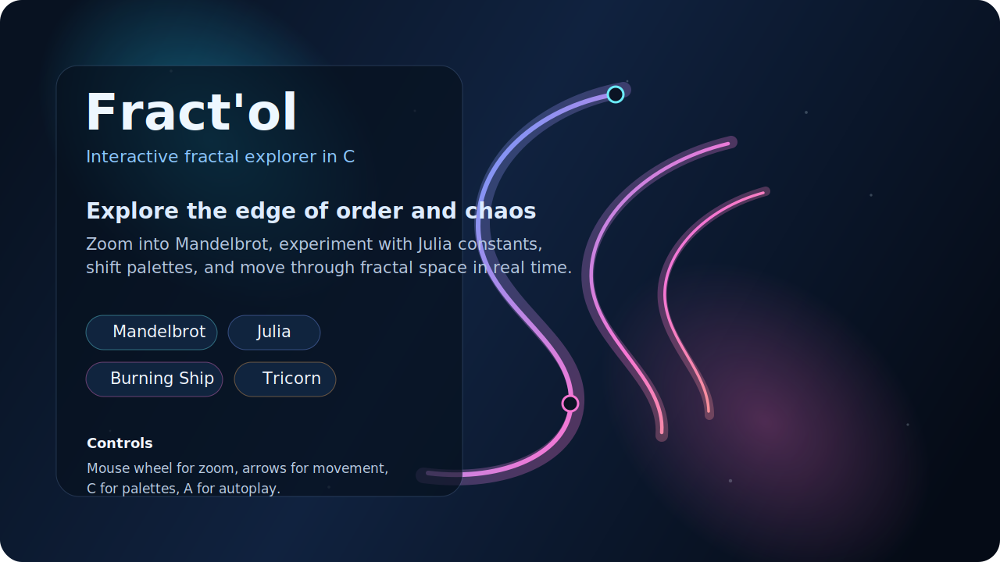
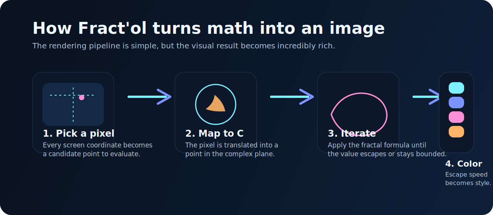

# Fract'ol



An interactive fractal explorer written in C for the 42 curriculum.

Fract'ol is where complex-number math stops being abstract and starts feeling alive. You launch a fractal, grab the mouse wheel, dive toward the edge of the set, shift the viewport, change the mood with new palettes, and watch simple formulas unfold into strange, detailed worlds.

This repository is meant to feel like the project itself: clear, curious, and fun to explore.

## What You Can Do Here

- Explore 4 fractal types
- Zoom directly toward the mouse cursor
- Pan through the complex plane with the keyboard
- Change the visual mood with multiple color palettes
- Increase iteration depth for more detail
- Launch an autoplay mode for ambient movement

## Quick Start

### macOS

```bash
brew install cmake glfw
make
./fractol mandelbrot
```

### Linux

```bash
sudo apt-get install cmake libglfw3-dev libxcursor-dev libxinerama-dev libxi-dev
make
./fractol mandelbrot
```

`MLX42` is already bundled inside this repository, so there is no extra graphics-library clone step.

## First Minute Demo

If you want to feel the project immediately, do this:

1. Run `./fractol mandelbrot`
2. Zoom toward the boundary with the mouse wheel
3. Pan with the arrow keys
4. Press `C` to switch palettes
5. Press `+` to increase detail
6. Launch a Julia set and compare the shape language

## Exploration Routes

### Route 1: Classic

```bash
./fractol mandelbrot
```

Start wide, then zoom toward the border where the interesting structure lives.

### Route 2: Experimental

```bash
./fractol julia -0.7269 0.1889
```

Try several Julia constants back-to-back and see how sensitive the geometry becomes.

### Route 3: Dramatic

```bash
./fractol burning_ship
```

Use slower zoom and palette changes. This one gets sharper and more aggressive the deeper you go.

### Route 4: Ambient

```bash
./fractol tricorn
```

Then press `A` to hand control to autoplay and let the project become a moving demo.

## How It Works



Every frame follows the same core idea:

1. Map each screen pixel to a point in the complex plane
2. Run a fractal formula repeatedly
3. Check whether the value escapes beyond a radius
4. Count how long that takes
5. Convert that count into color

That escape-time approach is what turns pure math into visible structure.

## Fractals Included

### Mandelbrot

The classic escape-time fractal based on:

```text
z = z^2 + c
```

This implementation also includes a cardioid and period-2 bulb shortcut to skip work on points already known to remain bounded.

### Julia

Julia sets fix the constant and let the starting point vary. Small parameter changes can create radically different visual structures.

Suggested values:

```bash
./fractol julia -0.4 0.6
./fractol julia 0.285 0.01
./fractol julia -0.70176 -0.3842
./fractol julia -0.835 -0.2321
./fractol julia -0.7269 0.1889
./fractol julia 0.0 -0.8
```

### Burning Ship

A sharper fractal built from absolute values before squaring. It produces harsh, flame-like shapes and gives the project a very different energy.

### Tricorn

A Mandelbrot-relative based on the complex conjugate. It has a colder, more mirrored symmetry and gives the bonus part real identity.

## Controls

| Input | Action |
|------|--------|
| Mouse wheel | Zoom in and out at the cursor position |
| Arrow keys | Move the viewport |
| `+` / `-` | Increase or decrease iteration depth |
| `C` | Cycle color palettes |
| `R` | Reset the active fractal view |
| `A` | Toggle autoplay mode |
| `H` | Print controls in the terminal |
| `I` | Print current fractal information |
| `ESC` | Exit the program |

## Under the Hood

The code is split by responsibility so the project is easier to defend, maintain, and extend:

- `main.c` handles startup and argument flow
- `init.c` and `controls.c` manage defaults and interaction state
- `fractal_calc.c` contains the mathematical formulas
- `render.c` maps pixels to the complex plane and paints the frame
- `events.c` and `events_utils.c` handle keyboard, scroll, and zoom logic
- `color.c` and `color_palettes.c` control the visual style
- `parse.c` validates Julia parameters safely
- `cleanup.c` centralizes shutdown behavior
- `autoplay.c` adds a lightweight self-running demo mode

## Project Structure

```text
Fractol/
|-- main.c
|-- init.c
|-- render.c
|-- fractal_calc.c
|-- events.c
|-- events_utils.c
|-- controls.c
|-- color.c
|-- color_palettes.c
|-- autoplay.c
|-- parse.c
|-- cleanup.c
|-- utils.c
|-- fractol_help.c
|-- fractol.h
|-- Makefile
|-- assets/
`-- MLX42/
```

## Build Rules

| Command | Effect |
|--------|--------|
| `make` | Build `MLX42` and compile `fractol` |
| `make bonus` | Build the same binary with integrated bonus features |
| `make clean` | Remove object files |
| `make fclean` | Remove object files, binary, and `MLX42/build` |
| `make re` | Full rebuild |

## What I Wanted From This Repo

I wanted this repository to feel:

- easy to clone
- easy to build
- easy to demo
- pleasant to explore
- more alive than a bare school hand-in

## Technical Notes

- The project currently uses `MLX42`
- Fractal math and navigation logic are separated from the graphics backend
- Build artifacts are ignored through `.gitignore`
- The source is organized in small files to keep the code readable and easier to explain

## Author

Created by `aeldiran` as part of the 42 curriculum.
